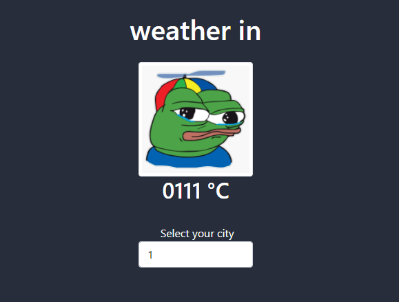

# VanillaJs

greetings

here i will upload projects using basic web technologies
like html, css, bootstrap and of course javascript.

the goal of this repository is to track my own progress as a developer, learn
git and maybe show this to my future employers

link to the index in github pages : https://mantra0111.github.io/VanillaJs/homePage/public/index.html

# March 09(tuesday) 2021 
iv'e created the homepage to store my vanillaJs projects, it looks like this ...

# March 10(wednesday) 2021
uploaded the first project, a calculator.
still have to fix some bugs and add functionality

# March 11(thursday) 2021
i created the interface for my second project using bootstrap 
this one will be a weather app, tomorrow i will try to make an
api call to actually fetch and display some data 

